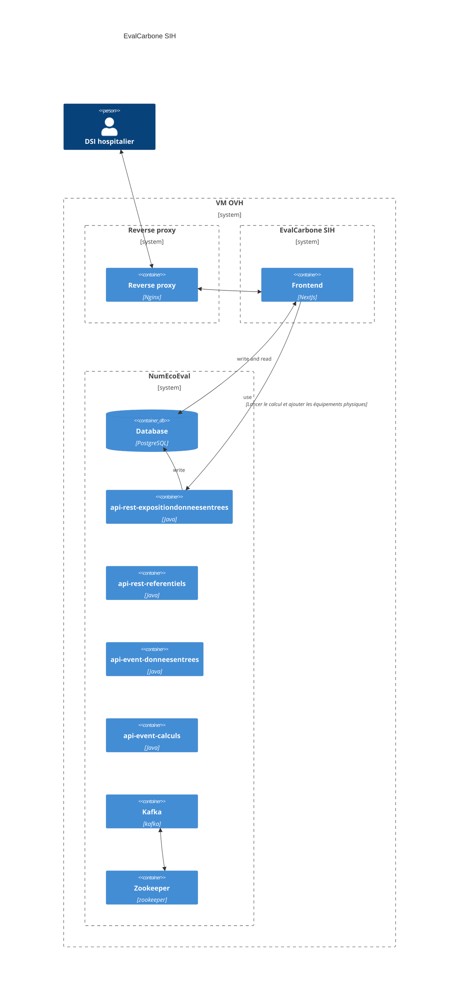

# EvalCarbone SIH

## Prérequis

- Ansible
- Docker CE
- NodeJs

## Installation locale

- `yarn`
- `npx husky init`
- `cp .env .env.local` (remplir les variables affectées par "A_REMPLIR")
- `yarn start:db` (il se peut que le container Kafka ne se lance pas du premier coup, le relancer)
- `yarn load_referentiels`
- `yarn dev`

## NumEcoEval

- [Le code source](https://gitlab-forge.din.developpement-durable.gouv.fr/pub/numeco/m4g/numecoeval)
- [Swagger api-rest-referentiels](http://localhost:18080/swagger-ui/index.html)
- [Swagger api-rest-expositiondonneesentrees](http://localhost:18081/swagger-ui/index.html)
- [Swagger api-event-calculs](http://localhost:18085/swagger-ui/index.html)

## Installation OVH

>Demander à Nathalie Baudiniere pour avoir accès à la VM OVH, il faudra donner une clé SSH publique.

Pour se connecter sur la VM OVH :

- `ssh ubuntu@eval-carbone-sih.esante.gouv.fr`

Tout se fait avec les recettes Ansible se trouvant dans `/infra`.\
Récupérer le fichier `.env.prod` sur la machine en question.
Puis :

- `ansible-galaxy collection install community.docker`
- `yarn deploy:backend` (joué la première fois ou lors d'une mise à jour)
- `yarn deploy:reverse-proxy` (joué la première fois ou lors d'une mise à jour)
  - Les fichiers crt et key peuvent être récupérés sur la VM ou en demandant à Nathalie Baudiniere
- `yarn deploy:referential` (joué la première fois ou lors d'une mise à jour)

## Procédure de secours pour relancer les conteneurs

En étant connecté sur la VM OVH avec `ssh`, il suffit de lancer les commandes suivantes :
```
# se placer dans le bon répertoire
cd /home/ubuntu/

# relancer le reverse proxy (nginx)
docker compose --file docker-compose-reverse-proxy.yml up -d --force-recreate

# relancer les conteneurs du front NumEcoEval
docker compose --file docker-compose-front.yml --env-file .env.prod --env-file .env.version up -d --force-recreate

# relancer les conteneurs du backend NumEcoEval
docker compose up -d --force-recreate
```

## Debugger Next-Auth

Pour débugger Next-Auth, il faut ajouter modifier la variable d'environnement `NODE_ENV` avec une valeur `development` dans le fichier `.env.prod` et relancer les conteneurs.

## Certificats non vérifiés

Pour indiquer à NodeJS de ne pas vérifier les certificats, il faut ajouter la variable d'environnement `NODE_TLS_REJECT_UNAUTHORIZED=0` dans le fichier `.env.prod` et relancer les conteneurs.
Cette variable permet d'indiquer à NodeJS de ne pas vérifier les certificats SSL lors des appels API.

### Schéma de la production



## Configuration GitHub 

La clé SSH privée (créée plus haut) doit être mise sur GitHub dans les [settings](https://github.com/ansforge/Eval-Carbone-SIH/settings/secrets/actions).

## Configuration Plage

Plage est le service d'authentification.

- [Documentation pour créer un compte de test](https://atih.atlassian.net/wiki/spaces/PUBLIC/pages/2979692685/Plage)
- [Documentation technique](https://atih.atlassian.net/wiki/external/YjE4MTQzOGU0YTNmNDFjNDg3MDcxMjY4NThkMzYzNGE)

## Les référentiels

A savoir lors d'une mise à jour des référentiels au format CSV :

- Les identifiants doivent être exactement les même, aucune typo (majuscule, caractère accentué,…), pas d'espaces en trop…
- Séparateur ";"
- Écrire les (types) équipements dans le même ordre

## Points d'attention pour le futur

- La mise à jour de NumEcoEval peut être douloureuse parce que
  - la plupart des appels se font directement sur la base de données (suppression, modification...) car les routes n'existent pas
  - il se peut que la base de données aura changé donc il faudra réécrire le front
- Idéalement, il faudrait utiliser le SaaS du Ministère de la Transition Ecologique (qui n'est pas encore en ligne à ce jour) et retirer la brique NumEcoEval mais voir le point numéro 1
- Avoir un système de monitoring de la base de données pour pouvoir la mettre à l'échelle s'il y a trop de données et pourrait faire ralentir l'application à long terme
- La base de données doit avoir un système de sauvegarde régulier au cas où la VM d'OVH doit être reconstruite
